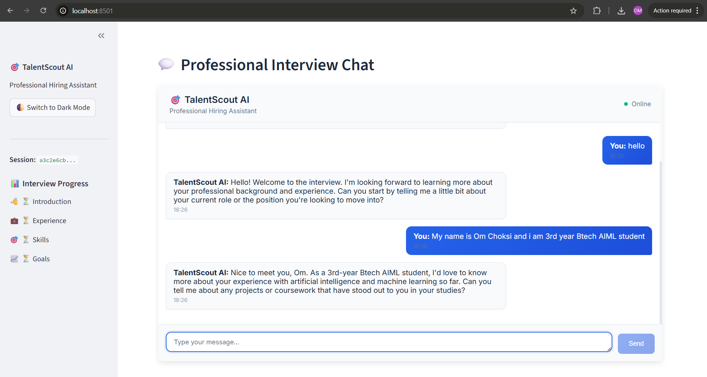
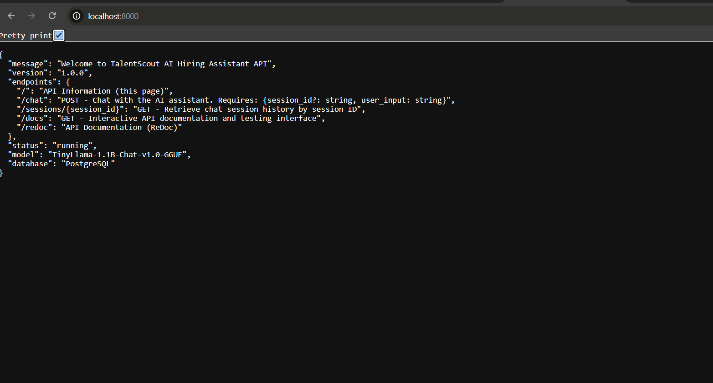

# Screenshots

This page showcases the TalentScout AI interface and features through screenshots of the application in action.

## Frontend Interface

The main interface features:

- **Clean Design**: Modern, professional interface with proper spacing and typography
- **Theme Support**: Toggle between light and dark modes seamlessly
- **Sidebar Navigation**: Session information and interview progress tracking
- **Chat Interface**: Real-time conversation with the AI hiring assistant
- **Progress Indicators**: Visual feedback on interview completion status

Key elements visible:

- 🎯 **TalentScout AI** branding and title
- 🌓 **Theme toggle** button for user preference
- **Session ID** display for tracking purposes
- **Interview Progress** with completion indicators:
  - 👋 Introduction
  - 💼 Experience  
  - 🎯 Skills
  - 📈 Goals
- **Chat area** with message history and input field

## Backend API

The backend API provides:

- **RESTful Endpoints**: Complete API for HR operations
- **Interactive Documentation**: Swagger/OpenAPI documentation at `/docs`
- **Health Monitoring**: Status endpoints for system monitoring
- **Session Management**: Persistent conversation tracking
- **Database Integration**: PostgreSQL for data persistence

API Information displayed:
- Welcome message and version info
- Available endpoints (`/`, `/chat`, `/sessions`, `/docs`, `/redoc`)
- System status and model information
- Database connection details

## User Experience Flow

### 1. Initial Welcome
The AI greets users professionally and begins the interview process with appropriate questions.

### 2. Interactive Chat
Users can engage in natural conversation while the AI maintains professional focus on HR-related topics.

### 3. Progress Tracking
The sidebar shows real-time progress through different interview stages.

### 4. Theme Customization
Users can switch between light and dark themes for comfortable viewing.

## Technical Features

### Responsive Design
The interface adapts to different screen sizes while maintaining professional appearance.

### Real-time Communication
- Messages are sent and received instantly
- Typing indicators show when the AI is processing
- Error handling provides clear feedback

### Session Persistence
- Conversation history is maintained across page refreshes
- Session IDs allow for tracking and resuming conversations
- Progress is saved automatically

### Professional Styling
- Consistent color scheme and typography
- Proper spacing and visual hierarchy
- Accessible design patterns

## Mobile Compatibility

The interface is designed to work seamlessly across devices:
- Desktop computers
- Tablets
- Mobile phones

## Accessibility Features

- High contrast color schemes
- Keyboard navigation support
- Screen reader compatibility
- Clear visual indicators

---

*All screenshots shown represent the current version of TalentScout AI and demonstrate the professional-grade interface designed for enterprise HR environments.*

